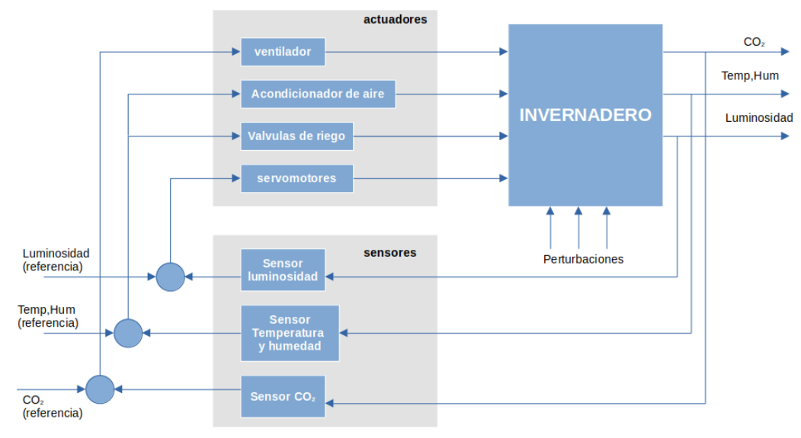
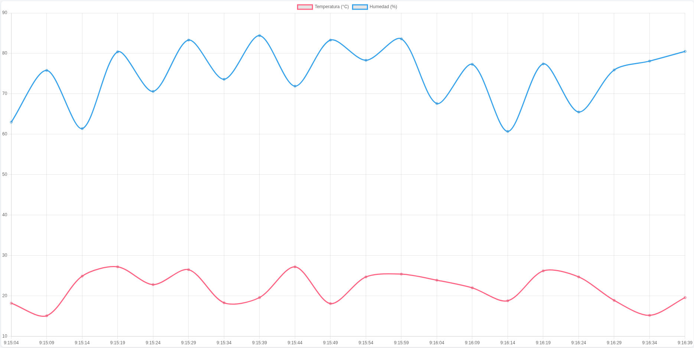
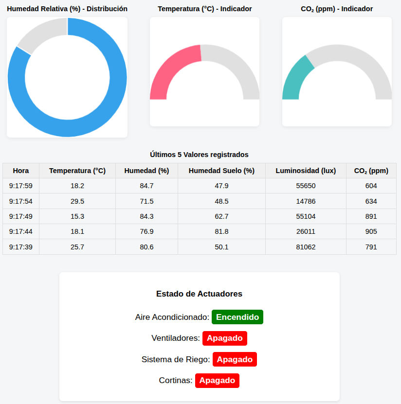
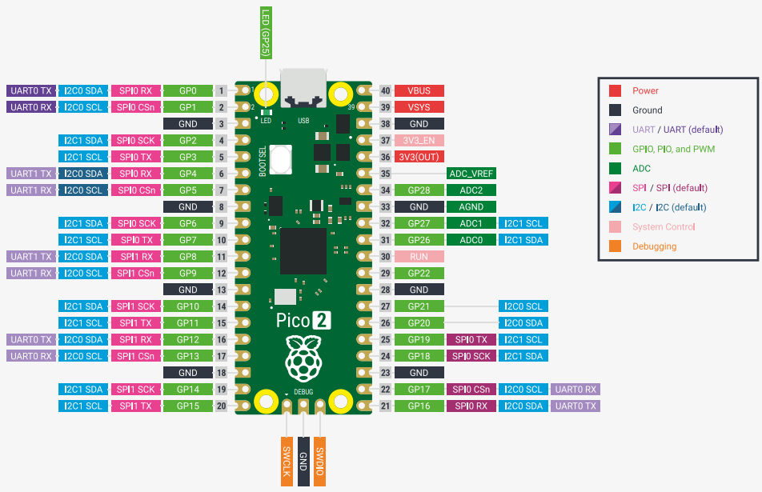

# AgroControl

# Descripción General

AgroControl es un sistema embebido en tiempo real que se usa para el monitoreo y control de variables ambientales en entornos agropecuarios. Permite medir y regular temperatura, humedad y luz en invernaderos y plantaciones, optimizando el crecimiento de cultivos y la eficiencia energética.

# Objetivo General

Desarrollar un sistema embebido en tiempo real basado en microcontrolador Placa Rp 2350 Raspberry Pi Pico 2W capaz de monitorear y controlar automáticamente variables ambientales clave en entornos agropecuarios, mejorando el crecimiento de cultivos y optimizando el uso de recursos mediante un sistema integrado de sensores y actuadores.

# Objetivos específicos

_Implementar la medición en tiempo real de temperatura, humedad, luminosidad y calidad del aire dentro del invernadero.

_Diseñar y desarrollar algoritmos de control automático en tiempo real para regular temperatura, humedad, CO2, luminosidad y riego según rangos óptimos.

_Integrar una interfaz web o aplicación móvil para monitoreo y control remoto accesible desde cualquier ubicación con internet.

_Garantizar la seguridad y fiabilidad del sistema mediante cifrado de datos, alertas automáticas y registro histórico de mediciones.

_Facilitar la escalabilidad del sistema para incorporar nuevos sensores o actuadores de forma modular y sin necesidad de rediseño completo.

# Alcance del Proyecto

El sistema AgroControl en su primera versión abarcará la medición y control automático de temperatura, humedad relativa, luminosidad, calidad del aire (CO2) y riego, exclusivamente para invernaderos y pequeños cultivos controlados. Incluirá monitoreo remoto en tiempo real a través de una interfaz web o app móvil, almacenamiento histórico de datos y gestión de alertas para mantenimiento y seguridad. No contempla la gestión de cultivos al aire libre ni la automatización avanzada basada en inteligencia artificial.

# Archivos del Proyecto

AgroControl/

├── CMakeLists.txt

├── FreeRTOS_Kernel_import.cmake

├── pico_extras_import_optional.cmake

├── pico_sdk_import.cmake

├── dht/
        
        │   ├── CMakeLists.txt        

│   ├── dht.c        

│   ├── dht.pio           

│   └── include/ 
        
        │       └── dht.h          

├── src/
    
    │   ├── main.c
    │   ├── include/
        │   │   └── FreeRTOSConfig.h    
        │   ├── wifi_init.c
        │   ├── wifi_init.h
        │   ├── http_server.c
        │   ├── http_server.h
        │   ├── dashboard_html.h
        │   └── CMakeLists.txt 

└── dashboard/
    
    └── dashboard_agrocontrol_v1-0.html

# Requerimientos Funcionales

_RF01 - Medición de variables ambientales: El sistema debe medir en tiempo real la temperatura, humedad relativa, luminosidad y calidad del aire dentro del invernadero mediante sensores instalados. Para ello debe operar con tres tipos de sensores: Sensor de temperatura y humedad, sensor de luminosidad, sensor de CO2.

_RF02 - Control automático de temperatura: El sistema debe activar un acondicionador de aire cuando la temperatura esté por fuera del rango establecido (entre 15 ºC y 25 ºC) para el cultivo.

_RF03 - Control automático de CO2: El sistema debe activar un ventilador cuando el porcentaje de CO2 esté por encima del rango establecido (entre 700 a 1000 [ppm]).

_RF04 - Control automático de humedad: El sistema debe activar los ventiladores para mantener la humedad relativa dentro del rango óptimo para el cultivo (entre el 65 % y el 75 % durante la noche y alrededor del 80 % durante el dı́a), mediante un control on/off basado en las lecturas del sensor de humedad.

_RF05 - Control automático de luminosidad: El sistema debe activar los servomotores para mantener la luminosidad dentro del rango óptimo de intensidad de luz (10000 a 95000 [lux]) mediante un control on/off para mover unas cortinas que frenen o dejen pasar la luz según la necesidad.

_RF06 - Control automático de riego: El sistema debe activar el sistema de riego (formado con electroválvulas) cuando la humedad del suelo esté por fuera del umbral (debajo del 40% y por encima del 80% de su capacidad de absorsción) y desactivarlo cuando se alcance el nivel máximo.

_RF07 - Monitoreo remoto: El sistema debe permitir la visualización y monitoreo en tiempo real de las variables ambientales desde una interfaz web o aplicación móvil accesible desde cualquier lugar con conexión a internet.

_RF08 - Registro histórico: El sistema debe almacenar un historial de las mediciones ambientales (KPIs) para análisis y toma de decisiones futuras.

_RF09 - Notificaciones y alertas: Durante el funcionamiento normal, el sistema generará pulsos de “keep alive”. En caso de no recibir dicho pulso, deberá enviar alertas automáticas al usuario indicando posible falla en las funciones de monitoreo/control, mediante mensajes en la aplicación/teléfono móvil, para que este pueda operar de manera manual o resetear el sistema. El reset puede ser por software remotamente y por hardware localmente.

# Requerimientos No Funcionales

_RNF01 - Usabilidad: La interfaz de usuario debe ser amigable e intuitiva para facilitar el uso por parte de operadores sin conocimientos técnicos avanzados.

_RNF02 - Disponibilidad: El sistema debe estar operativo al menos el 99% del tiempo, garantizando el monitoreo continuo de las condiciones ambientales.

_RNF03 - Tiempo de respuesta: El sistema debe procesar y mostrar las lecturas de sensores con un retraso máximo de 10 segundos para permitir una reacción rápida ante cambios ambientales.

_RNF04 - Seguridad: Los datos transmitidos entre sensores, actuadores y la interfaz deben estar cifrados para proteger la información y evitar accesos no autorizados.

_RNF05 - Escalabilidad: El sistema debe ser capaz de integrar nuevos sensores o actuadores adicionales sin necesidad de rediseño completo.

_RNF06 - Compatibilidad: La interfaz debe ser compatible con los principales navegadores web y sistemas operativos móviles actuales.

# Dependencias

El proyecto depende de varias bibliotecas y componentes:

_FreeRTOS: Sistema operativo en tiempo real que permite la gestión eficiente de tareas concurrentes.

_Pico SDK: Biblioteca de soporte para la Raspberry Pi Pico, proporcionando funciones esenciales de hardware y software.

_lwIP: Implementación ligera de la pila TCP/IP, utilizada para la comunicación de red.

_DHT Library: Biblioteca específica para sensores de temperatura y humedad, facilitando la adquisición de datos.

# Dashboard

El dashboard presenta un panel de control web con gráficos en tiempo real que muestran temperatura, humedad, luminosidad y niveles de CO2, así como el estado de actuadores como ventiladores, acondicionadores de aire y sistema de riego. Incluye botones para activar o desactivar manualmente cada dispositivo y recibir alertas automáticas.

# Placa Rp 2350 Raspberry Pi Pico 2W

El pinout de la placa para desarrollar el sistema incluye:

_Pines GPIO para conexión de sensores (DHT, luminosidad, CO2) y actuadores (servomotores, electroválvulas).

_Interfaces SPI/I2C para sensores específicos.

_Pines de alimentación y tierra.

_Pines UART para depuración y comunicación adicional.

# Mejoras y Funcionalidades Futuras

_Implementación de algoritmos predictivos basados en IA para optimizar automáticamente el control ambiental según tendencias meteorológicas y crecimiento de plantas.

_Ampliación del sistema para soportar más tipos de sensores y actuadores, así como integración con sistemas de agricultura inteligente.

_Mejoras en la interfaz de usuario para incluir recomendaciones y análisis avanzados.

_Integración de energía renovable y optimización energética.

_Desarrollo de un sistema de mantenimiento predictivo con alertas anticipadas de fallas en hardware.

_Soporte para redes LoRa o 5G para ampliar la conectividad del sistema en zonas remotas.

_Agregar ejecución concurrente asignando un núcleo al control de sensores y el otro a correr un servidor web embebido con conectividad Wi-Fi integrada.

